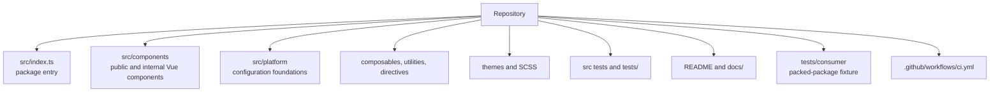
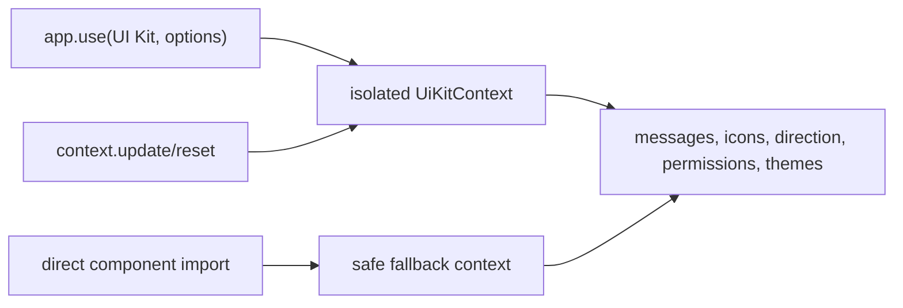

# Project Knowledge

This document is the canonical architecture and behavior guide for the UI Kit. Read it with [DEVELOPMENT_GUIDE.md](./DEVELOPMENT_GUIDE.md) before changing the repository. Planned work belongs in [ROADMAP.md](./ROADMAP.md), not in this description of current behavior.

> Reference baseline: this knowledge reflects the v2 stabilization and platform-foundation work. The repository may not contain a branch literally named `stable`; always verify the current ref before making changes.

## 1. Project vision

The repository is a reusable Vue 3 UI package built around Vuetify and TypeScript. It began as a Persian-first component collection and is evolving into an application-isolated UI platform.

Its goals are to provide:

- reusable components with stable package-root imports;
- Persian/RTL and English/LTR foundations;
- consistent messages, icons, permissions, async states, themes, and tokens;
- a feature-rich data table for local and HTTP-backed data;
- ESM, CommonJS, declarations, and one distributable CSS entry;
- validation against a real packed-package consumer.

Supported consumers are Vue 3 applications using Vuetify 3. Vue Router is an optional package peer, but components that use routing—especially `CustomDataTableV2`—require an installed router. Some public components also require Pinia or browser APIs.

Supported build environments use Node `^20.19.0` or `>=22.12.0` and npm. The library targets browser applications. Full server-side rendering compatibility is not claimed.

Non-goals of the current foundation include backend authorization, a full i18n framework, a schema-form engine, business workflow logic, and automatic ownership of consumer Router, Pinia, or Vuetify instances.

## 2. Repository architecture

| Location | Responsibility |
| --- | --- |
| `src/index.ts` | Public package entry, default plugin, named exports, CSS import |
| `src/components/shared` | Reusable controls, cards, fields, dialog, download, DataTable |
| `src/components/common` | Shared higher-level presentation such as `AppStepper` |
| `src/components/layout` | Header, sidebar, layout, and internal navigation components |
| `src/components/state` | Focused async-state presentation components |
| `src/components/permissions` | Generic permission-aware rendering |
| `src/platform` | Provider, defaults, messages, icons, permissions, themes, public types |
| `src/composables` | DataTable-oriented reusable state and action logic |
| `src/directives` | Generic directives; only selected directives are public |
| `src/utils` | Generic formatters, validation helpers, HTTP/auth bootstrap utilities |
| `src/theme` | Existing Vuetify light and dark theme definitions |
| `src/scss` | Package styles and semantic foundation tokens |
| `tests/components` | Public component characterization tests |
| `tests/data-table-v2` | DataTable integration and edge-case matrix |
| `tests/platform` | Provider and foundation contracts |
| `tests/utils` | Shared mounting infrastructure |
| `tests/consumer` | External consumer fixture installed from `npm pack` |
| `docs` | Component, utility, platform, and behavior documentation |

The repository also contains application-oriented services, stores, authentication helpers, assets, and demonstration code. Presence under `src` does not make an API public. Package-root exports in `src/index.ts` are authoritative.

## 3. Public package architecture

The package exposes a default Vue plugin plus named components, composables, directives, utilities, bootstrap helpers, stores, and types. The main public families are:

- plugin: default export, `install`, and `UiKitPlugin`;
- platform: `createUiKit`, `useUiKit`, focused platform composables, themes, types, and async guards;
- components: shared controls, layout components, state components, `PermissionGuard`, and DataTable aliases;
- composables: `useDataTable`, `useTableActions`, table headers, and table selection;
- directive: `DigitLimit`;
- utilities: dates, greetings, numbers, national-code validation, fetch/auth helpers;
- integrations: Axios configuration, Keycloak setup, and application bootstrap;
- state: `useCustomizerStore`;
- types: DataTable, menu, platform, bootstrap, and generic enum contracts.

The plugin provides a per-application UI Kit context and registers `v-digit-limit`. It deliberately does not register the older application-specific permission directive.

Internal APIs include the provider injection key, test mount helpers, DataTable filter/rendering internals, navigation subcomponents, platform defaults not exported from the package root, and application-specific stores/directives/types excluded by `src/index.ts`.

Public source does not guarantee published availability. `tsconfig.lib.json`, Vite library configuration, the package export map, and the packed consumer collectively define the shipped surface.

## 4. Component catalog

Maturity labels: **established** has meaningful production behavior and tests; **stabilizing** is public but has known coupling or coverage gaps; **foundation** is a newer, focused API with platform tests.

| Component | Category and purpose | Maturity | Dependencies | Test/a11y status and limitations |
| --- | --- | --- | --- | --- |
| `BaseBreadcrumb` | Shared breadcrumb navigation | Stabilizing | Vue Router, Vuetify, provider | Provider direction and typed destinations; focused migration coverage |
| `BaseIcon` | Static or interactive icon wrapper | Established | Vue, provider | Native button semantics and direct tests; consumers must provide meaningful labels |
| `ConfirmDialog` | Confirm/cancel dialog | Established | Vuetify, provider | Accessible naming and localized defaults; real-browser focus lifecycle remains unverified |
| `CustomAutocomplete` | Reusable autocomplete field | Stabilizing | Vuetify | Accessibility correction; incomplete direct coverage |
| `CustomDataTableV2` | Local/remote data grid, CRUD, export, grouping | Established but high-risk | Vuetify, Router, Axios, browser APIs; optional XLSX | Extensive integration coverage; large and tightly coupled |
| `CustomDataTable` | Compatibility alias of `CustomDataTableV2` | Established | Same as V2 | Same implementation and contract |
| `DescriptionInput` | Description/text input | Stabilizing | Vuetify | No focused public contract suite confirmed |
| `DownloadButton` | Provider-aware download action | Stabilizing | Vuetify, provider, browser APIs | Foundation migration coverage; browser-only action |
| `MoneyInput` | Monetary input | Stabilizing | Vuetify | No focused public contract suite confirmed |
| `PdfViewer` | PDF presentation | Stabilizing | Browser APIs | Browser-dependent and not covered by a real-browser suite |
| `ShamsiDatePicker` | Persian/Jalali date input | Stabilizing | Persian date-picker package, browser DOM | Direct characterization tests; third-party accessibility boundaries remain |
| `ToggleSwitch` | Boolean/string toggle | Established | Vue, provider | Native switch semantics, disabled state, RTL logical styling, direct tests |
| `UiChildCard` | Child-level card container | Stabilizing | Vuetify | No focused public contract suite confirmed |
| `UiParentCard` | Parent-level card container | Stabilizing | Vuetify | No focused public contract suite confirmed |
| `VPriceTextField` | Price-oriented field | Stabilizing | Vuetify | No focused public contract suite confirmed |
| `AppStepper` | Step navigation/content host | Established | Vue | Button semantics, disabled steps, direction, v-model tests |
| `Loading` | Global loading overlay | Stabilizing | Pinia customizer store, Lottie, provider | Live-region coverage; requires store context and browser animation asset |
| `AppHeader` | Application header and action slots | Stabilizing | Vuetify, provider | Semantic icons and labels tested; some default labels remain literal English |
| `AppSidebar` | Application navigation sidebar | Stabilizing | Vuetify, application menu conventions | Limited focused coverage |
| `AppLayout` | Header/sidebar/content composition | Stabilizing | Vuetify and layout children | Limited focused coverage |
| `UiLoadingState` | Focused loading state | Foundation | Provider, Vuetify | Localized and accessible; platform tested |
| `UiEmptyState` | Empty state with optional action | Foundation | Provider, Vuetify | Accessible action and platform tests |
| `UiErrorState` | Error state with optional retry/details | Foundation | Provider, Vuetify | Details are explicit and safe; platform tested |
| `UiPermissionDenied` | Permission-denied state | Foundation | Provider, Vuetify | Accessible action and platform tests |
| `UiAsyncState` | Dispatcher for idle/loading/empty/error/success/denied | Foundation | Focused state components | Named state slots and platform tests; does not execute requests |
| `PermissionGuard` | Permission-aware hide/disable/fallback wrapper | Foundation | Provider | Platform tested; presentation only, never authorization |

Internal Vue components include `NavCollapse`, `NavGroup`, `NavItem`, and DataTable filter fields. They must not be imported as stable package APIs.

## 5. Platform foundation

`createUiKit` creates a context from `UiKitConfig`. Plugin installation provides a newly created context to one Vue application. Nested maps are cloned, so consumer mutation and installation in another app do not leak configuration.

`useUiKit` injects the private context. Without installation it returns a safe fallback configured for Persian and automatic RTL. Focused composables expose configuration, locale/direction, messages, icons, and permissions.

`context.update()` merges valid runtime changes. `reset()` restores built-in defaults. Invalid runtime direction values are ignored. The provider does not modify `document.documentElement`; consumers decide how global direction and themes are applied.

## 6. Theme system

`defaultThemes` contains `modern` and `modern-dark`, based on the existing light and dark Modern Vuetify themes. `createUiKitThemes` merges overrides, clones definitions, and validates names, `dark`, color maps, and non-empty color strings. Overrides win by theme name. `mergeThemes` performs a shallow typed merge.

Semantic CSS variables live in `src/scss/foundation/_tokens.scss` and are included through `src/scss/style.scss`. Governed categories include colors, spacing, radii, elevations, motion duration/easing, focus, and z-index. Reduced-motion behavior is included. Packed-package verification checks representative variables from each category.

Token adoption is incomplete: older SCSS and components still use raw values or Vuetify variables. New shared styling should use semantic `--ui-*` tokens with an appropriate fallback.

## 7. Localization

Built-in message catalogs are `fa-IR` and `en-US`. Automatic direction treats Persian, Arabic, Hebrew, and Urdu locale prefixes as RTL; other locales are LTR. Message catalog selection intentionally recognizes Persian and English variants: Persian variants use Persian defaults, while unknown languages use English defaults.

Resolution order is exact-locale override, built-in-language override, then built-in catalog. Explicit empty strings are preserved. Plain `{name}` placeholders interpolate string, number, or boolean values. Missing placeholders remain visible. Messages are text, never evaluated as HTML.

This is a focused component-message system, not a replacement for a consumer application's full localization framework.

## 8. Permission model

Permissions control UI presentation. Configuration accepts a synchronous evaluator or permission options. Requirements may be a single permission, an `any` list, an `all` list, or a combined object.

- no requirement allows;
- empty permission strings deny;
- `{ any: [] }` denies;
- `{ all: [] }` allows;
- evaluator exceptions are contained and deny that requirement;
- missing evaluator is fail-open by default for compatibility and can be configured fail-closed.

`usePermission` exposes `can`, `any`, and `all`. `PermissionGuard` supports fallback content plus hide and disable presentation modes.

This model does not perform backend authorization, secure routes, validate tokens, or support asynchronous evaluators. Server-side authorization remains mandatory. The older application-specific `v-permission` directive is separate from this foundation.

## 9. Async state model

Supported statuses are `idle`, `loading`, `empty`, `error`, `success`, and `permission-denied`. The generic data contract is publicly named `UiAsyncStateModel<T, E>` to avoid collision with the `UiAsyncState` component.

Focused components present loading, empty, error, and denied states. `UiAsyncState` selects the correct presentation and provides `loading`, `empty`, `error`, `permission-denied`, and default slots. It never starts, retries, or cancels requests itself.

Use the state model at feature boundaries, keep request ownership in the feature, expose retry as an explicit action, and do not reveal error details unless the consumer opts in.

## 10. DataTable architecture

The package exports one implementation under `CustomDataTableV2` and `CustomDataTable`.

### Data and requests

Local mode renders `items` and tracks prop replacement. Remote mode performs `GET` against `apiResource` when `autoFetch` is enabled. Paged requests send zero-based `page` and `size`; the UI page is one-based. Paged responses use `data.content` with optional page metadata. Unpaged mode accepts arrays, `{ content }`, a single object, or an empty/malformed body that normalizes to no rows.

Generated filters, component query parameters, external criteria, and per-call query parameters have defined precedence. External criteria suppress generated filters when non-empty. Only the newest request may publish data, errors, pagination, or loading state. Older and post-unmount results are ignored, but requests are not cancelled.

### Filtering and pagination

Generated filters exclude empty strings, `null`, and `undefined`. Ordinary fields use `field=value`; operator fields use keys such as `field.contains`. Supported behavior covers equality, inequality, containment, `in`, specified, and numeric comparisons. Generated changes debounce by 300 ms; explicit apply fetches immediately. A filter adapter or `setCriteria` can replace criteria.

Remote sorting is not implemented even though a `sortBy` prop exists. Local pagination, filtering, and sorting are delegated to Vuetify rather than translated into a separate component contract.

### Selection and grouping

Selection supports a string, nested path, or function `uniqueKey`, controlled `selectedItems`, and both selection emits. Bulk mode forces single selection. Flat grouping supports field/function keys, sorted groups, keyboard expand/collapse, and exposed group controls. Nested groups and group-level selection are unsupported.

### CRUD, routing, export, and browser actions

Generated CRUD performs create, full-body update, row delete, and group delete. Custom keys—including numeric zero and empty string—are valid edit/delete identities. Successful group delete clears selection and refreshes; failure preserves selection.

Route templates interpolate item fields and call the installed router. Missing fields or rejected navigation surface an error. Named route objects and advanced query construction are unsupported.

Client export dynamically imports optional `xlsx`, maps titled headers, localizes booleans, and can append money totals. Server export accepts supported base64 response shapes. Downloads use fetch with Axios fallback, temporary anchors, Blob URLs, and cleanup. Clipboard uses the modern API with an `execCommand` fallback.

The only implemented public named slot is `inline-filter-actions`. Exposed methods cover fetch, items, selection, grouping, filters, criteria, and form state. Extensive tests under `tests/data-table-v2` protect requests, filtering, rendering, actions, concurrency, keys, export, download, clipboard, dialogs, and accessibility semantics.

Known limitations are its large mixed-responsibility implementation, Router coupling, browser-only features, no cancellation, no remote sorting, limited slots, no partial bulk success, and incomplete real-browser dialog verification.

## 11. Build and package

`npm run build:lib` typechecks, builds ESM/CJS/CSS through Vite, and emits declarations through `vue-tsc`. Output contracts are:

- `dist/ui-kit.es.js`;
- `dist/ui-kit.cjs`;
- `dist/index.d.ts`;
- `dist/style.css`.

Vue, Vuetify, Router, Pinia, Axios, and feature dependencies are externalized as appropriate. `xlsx` is optional and dynamically loaded. CSS is listed as a package side effect so bundlers retain it.

`scripts/verify-packed-package.mjs` creates a temporary tarball and consumer, installs the package, typechecks, builds, validates ESM/CJS resolution, checks expected package files and semantic CSS, and confirms private `src` files are excluded.

CI uses npm installation and runs lint, typecheck, tests, coverage, library build, packed-consumer verification, and whitespace checks.

## 12. Testing architecture

Vitest runs in Happy DOM with Vue and Vuetify plugins. `tests/setup.ts` supplies shared environment setup. `mountWithApp` installs Vuetify, UI Kit, Pinia, and a memory router, and accepts provider configuration.

Tests are organized as:

- adjacent unit tests for utilities, directives, composables, and DataTable helpers;
- `tests/components` for public component behavior;
- `tests/platform` for isolation, updates, messages, icons, permissions, states, and themes;
- `tests/data-table-v2` for public integration behavior;
- `tests/consumer` for published-package consumption.

Known gaps include no coverage thresholds, no real-browser suite, no visual regression, incomplete direct tests for several legacy components, and Happy DOM limitations around focus lifecycle and browser downloads.

## 13. Accessibility

Current foundations use native buttons for interactive controls, labels and descriptions for dialogs, live/busy semantics for loading and DataTable, keyboard-operable group controls, named row/select-all/copy controls, disabled semantics, and provider direction.

Accessibility remains incomplete. Focus trapping, Escape behavior, focus restoration, third-party widgets, high contrast, zoom/reflow, and screen-reader behavior require real-browser or manual testing. Literal labels and incomplete platform migration remain in older components.

New behavior must have semantic markup first, keyboard support, accessible names, visible focus, direction-aware layout, reduced-motion behavior where relevant, and tests at the closest reliable level.

## 14. Browser dependencies

| Dependency | Affected behavior |
| --- | --- |
| Vue Router | DataTable route actions, breadcrumb destinations, application layout navigation |
| `navigator.clipboard` | DataTable copy, with legacy fallback |
| Blob and URL APIs | Export and file download |
| `document` | Temporary anchors, clipboard fallback, teleported dialogs |
| `window` | URL support and viewport/scroll behavior |
| scrolling/intersection-style state | Infinite-scroll DataTable behavior |
| third-party browser components | Lottie, Persian date picker, PDF viewer |

Foundations avoid global document mutation, but the package as a whole is not SSR-certified. Import safety and render safety must be evaluated separately for browser-dependent components.

## 15. Current known limitations

- No authoritative branch named `stable` was present during the foundational audit.
- DataTable remains large and mixes data, network, routing, CRUD, export, download, and rendering.
- DataTable requests are not cancelled and remote sorting is unsupported.
- DataTable and some layout/shared components require Router, Pinia, Axios, or browser APIs.
- Optional XLSX and the Happy DOM test environment have documented dependency advisories.
- Type declaration compilation is not strict.
- ESLint permits warnings for several quality rules.
- Semantic token and provider adoption is incomplete.
- Several public legacy components lack focused contract tests.
- There is no form, upload, or workflow foundation.
- There is no Storybook/component explorer, visual regression, bundle budget, or real-browser accessibility suite.
- Full SSR support is not claimed.

## 16. Design principles

1. Preserve package-root compatibility and test the packed artifact.
2. Keep plugin installation optional and fallback behavior safe.
3. Keep platform configuration isolated per Vue application.
4. Keep injection keys and test utilities internal.
5. Keep foundations independent of Router and Pinia.
6. Prefer typed Composition API contracts and conventional v-model events.
7. Use semantic messages, icons, themes, and tokens instead of new literals.
8. Treat accessibility as behavior, not decoration.
9. Add characterization tests before changing complex legacy behavior.
10. Separate confirmed current behavior from roadmap proposals.
11. Never treat UI permission checks as security authorization.
12. Introduce breaking changes only with an explicit release and migration plan.

## 17. Glossary

| Term | Meaning |
| --- | --- |
| UI Kit | The published package and its default Vue plugin |
| Platform foundation | Per-app configuration, locale, messages, icons, permissions, states, themes, and tokens |
| Provider | The application-specific `UiKitContext` registered during plugin installation |
| Fallback context | Safe Persian/RTL-auto configuration used by direct imports without installation |
| Semantic icon | Meaning-based icon key resolved to a string or Vue component |
| Semantic token | Stable `--ui-*` CSS variable representing design intent |
| DataTable V2 | The current table implementation exported under both DataTable names |
| Local mode | DataTable behavior driven by the `items` prop without remote fetch |
| Remote mode | DataTable behavior driven by `apiResource` and Axios requests |
| Characterization test | A test that records existing behavior before refactoring |
| Consumer fixture | Temporary external application that installs the packed tarball |
| Public API | An identifier exported by `src/index.ts` and successfully emitted in the package |
| Internal API | Source available inside the repository but not promised at the package root |
