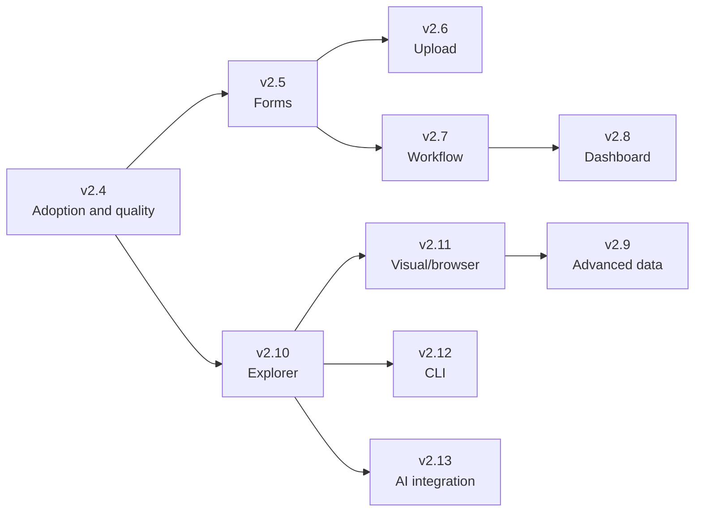

# Roadmap

This roadmap separates completed foundations from planned work. It contains no delivery dates. Current architecture is documented in [PROJECT_KNOWLEDGE.md](./PROJECT_KNOWLEDGE.md); implementation rules are in [DEVELOPMENT_GUIDE.md](./DEVELOPMENT_GUIDE.md).

Status vocabulary:

- **Completed**: implemented and protected at the current documented baseline.
- **In progress**: partially implemented or adopted, with confirmed remaining work.
- **Planned**: agreed logical next phase, not current behavior.
- **Exploratory**: valuable direction requiring discovery before commitment.

## Current version

The package metadata is on the `1.9.x` line while the repository architecture and current DataTable are described as v2. Future release numbering must be reconciled explicitly; this roadmap uses suggested `v2.x` milestones and does not itself change package versioning.

The current maturity classification is **UI platform**: package and provider foundations exist, but component-wide adoption, real-browser quality gates, and higher-level form/upload/workflow systems remain incomplete.

## Decision records

| Decision | Rationale | Consequence |
| --- | --- | --- |
| Keep foundations application-isolated | Multiple Vue apps must not share mutable configuration | Injection key stays private; inputs are cloned |
| Keep plugin installation optional | Direct component imports are a compatibility requirement | Every provider-aware component needs safe fallbacks |
| Preserve both DataTable names | Existing consumers import both aliases | Changes must protect both package-root exports |
| Treat permissions as presentation only | UI visibility cannot enforce security | Backend authorization remains a consumer responsibility |
| Verify the packed artifact | Source exports alone do not prove published usability | ESM, CJS, types, CSS, and LICENSE are consumer-tested |
| Evolve DataTable through characterization | Its mixed responsibilities make broad rewrites risky | Behavior tests precede decomposition |

## Completed milestones

### v2.0 — Package stabilization

| Attribute | Value |
| --- | --- |
| Goal | Make installation, CI, publishing, and external consumption reproducible |
| Dependencies | Existing Vite library build |
| Acceptance criteria | npm metadata and lockfile standardized; LICENSE packaged; CSS side effects correct; CI and packed consumer validate ESM/CJS/types/CSS |
| Breaking risk | Low; Yarn contributor workflow removed |
| Priority | Critical |
| Status | Completed |

### v2.1 — Component and accessibility safety net

| Attribute | Value |
| --- | --- |
| Goal | Characterize shared public behavior and correct critical interactive semantics |
| Dependencies | Shared mounting utilities and Vuetify test environment |
| Acceptance criteria | Direct tests for representative components; native controls, accessible labels, loading/live semantics, RTL-aware interaction |
| Breaking risk | Low to medium where DOM structure changed |
| Priority | Critical |
| Status | Completed |

### v2.2 — DataTable stabilization

| Attribute | Value |
| --- | --- |
| Goal | Protect current DataTable behavior and correct high-impact edge cases |
| Dependencies | Integration harness and package aliases |
| Acceptance criteria | Local/remote, filters, actions, selection, grouping, export, download, clipboard, dialogs, keys, concurrency, and failures covered; latest request wins |
| Breaking risk | Medium because incorrect observable behavior was corrected |
| Priority | Critical |
| Status | Completed |

### v2.3 — Platform foundations

| Attribute | Value |
| --- | --- |
| Goal | Establish shared configuration for locale, direction, messages, icons, permissions, states, themes, and tokens |
| Dependencies | Vue provide/inject and existing Vuetify themes |
| Acceptance criteria | Per-app isolation, direct-import fallback, runtime updates, semantic APIs, async components, theme validation, packed token verification |
| Breaking risk | Low; additive with provider-aware default changes |
| Priority | Critical |
| Status | Completed |

## In progress

### v2.4 — Foundation adoption and quality gates

| Attribute | Value |
| --- | --- |
| Goal | Complete adoption of existing foundations and close verification gaps before adding a major subsystem |
| Dependencies | v2.3 foundations |
| Acceptance criteria | Remaining shared literals and directional CSS inventoried; priority components migrated; coverage and bundle budgets defined; support matrix documented; real-browser accessibility path operational |
| Breaking risk | Low to medium depending on default-label changes |
| Priority | High |
| Status | In progress: selected components are migrated, adoption is incomplete |

Scope includes provider/message/icon/token adoption, tests for uncharacterized public components, real-browser accessibility setup, and explicit SSR/browser support documentation. It excludes a broad DataTable rewrite.

## Future milestones

### v2.5 — Form foundation

| Attribute | Value |
| --- | --- |
| Goal | Define consistent field, validation, model, error, hint, disabled, and readonly behavior |
| Dependencies | v2.4 message/token/accessibility gates |
| Acceptance criteria | Typed field shell; accessible ID/description wiring; RTL/LTR support; validation adapter boundary; representative input migrations; package and browser tests |
| Breaking risk | Medium for existing field defaults and event behavior |
| Priority | Highest planned |
| Status | Planned |

Exclude a schema-form engine and business-specific validation. Preserve existing v-model contracts through adapters or migration documentation.

### v2.6 — Upload and file foundation

| Attribute | Value |
| --- | --- |
| Goal | Provide consistent file selection, validation, progress, cancellation, errors, and accessible status |
| Dependencies | Form and async-state foundations |
| Acceptance criteria | Single/multiple file contracts; size/type validation; progress/cancel hooks; browser cleanup; retry and accessibility tests; no fixed backend protocol |
| Breaking risk | Low if introduced additively |
| Priority | High |
| Status | Planned |

### v2.7 — Workflow foundation

| Attribute | Value |
| --- | --- |
| Goal | Standardize multi-step and approval-style presentation without embedding domain rules |
| Dependencies | Form, permissions, async states, and stepper contracts |
| Acceptance criteria | Typed steps/statuses/actions; permission-aware actions; accessible progress; resumable consumer-owned state; no business-domain imports |
| Breaking risk | Medium if replacing existing stepper patterns |
| Priority | Medium-high |
| Status | Planned |

### v2.8 — Dashboard foundation

| Attribute | Value |
| --- | --- |
| Goal | Provide composable dashboard layout, cards, metrics, empty/loading/error states, and responsive behavior |
| Dependencies | Tokens, themes, async states, and component explorer |
| Acceptance criteria | Responsive primitives; semantic metric/status presentation; RTL/LTR layouts; documented composition patterns; visual tests |
| Breaking risk | Low when additive |
| Priority | Medium |
| Status | Planned |

### v2.9 — Advanced data components

| Attribute | Value |
| --- | --- |
| Goal | Improve data-heavy experiences while preserving the current DataTable contract |
| Dependencies | Stable DataTable characterization and browser testing |
| Acceptance criteria | Explicit contracts for remote sorting/cancellation and any new slots; bounded controller seams; compatibility tests; performance budget |
| Breaking risk | High around request and rendering contracts |
| Priority | Medium |
| Status | Planned |

This phase may include staged DataTable decomposition, but only after each seam is characterized. It must not begin as an unbounded rewrite.

### v2.10 — Developer experience and component explorer

| Attribute | Value |
| --- | --- |
| Goal | Make every public component discoverable and testable through maintained examples |
| Dependencies | Stable public contracts and documentation taxonomy |
| Acceptance criteria | Storybook or equivalent explorer; provider/theme/locale matrices; generated API references where reliable; contribution templates |
| Breaking risk | Low |
| Priority | High |
| Status | Planned |

### v2.11 — Visual regression and browser certification

| Attribute | Value |
| --- | --- |
| Goal | Detect visual, RTL, theme, focus, and responsive regressions in real browsers |
| Dependencies | Component explorer and browser runner |
| Acceptance criteria | Deterministic snapshots across core themes/directions; dialog focus tests; reduced-motion checks; documented browser support |
| Breaking risk | Low; may reveal required corrections |
| Priority | High |
| Status | Planned |

### v2.12 — Tooling and CLI

| Attribute | Value |
| --- | --- |
| Goal | Automate repetitive consumer setup and contribution checks only where automation is demonstrably valuable |
| Dependencies | Stable package/configuration conventions |
| Acceptance criteria | Discovery validates concrete use cases; generated output is deterministic; dry-run and migration docs exist; no hidden consumer mutation |
| Breaking risk | Medium if configuration is generated |
| Priority | Low-medium |
| Status | Exploratory |

### v2.13 — AI-assisted integration

| Attribute | Value |
| --- | --- |
| Goal | Make documented component contracts safely consumable by coding assistants and design-to-code workflows |
| Dependencies | Canonical docs, component explorer, machine-readable API metadata, stable releases |
| Acceptance criteria | Structured component metadata; examples cite public imports; generated code passes consumer validation; privacy/security review complete |
| Breaking risk | Low to library runtime; higher governance risk |
| Priority | Low |
| Status | Exploratory |

AI integration does not mean embedding model calls into core UI components. Any runtime AI feature requires a separate product and security decision.

## Priority sequence

The highest-value next investment is the form foundation, but it should start only after a bounded v2.4 checkpoint establishes browser testing, support documentation, and agreed quality budgets.

## Release readiness policy

A milestone is release-ready only when:

- its public contracts and compatibility impact are documented;
- focused tests and appropriate browser checks pass;
- typecheck, build, and packed-consumer verification pass;
- package-root exports and declarations are verified;
- accessibility and RTL/LTR acceptance criteria are addressed;
- known limitations are explicit;
- breaking changes have a migration guide and suitable version boundary.

Roadmap status must be updated when behavior ships. Planned features must never be described as current behavior in `PROJECT_KNOWLEDGE.md`.
