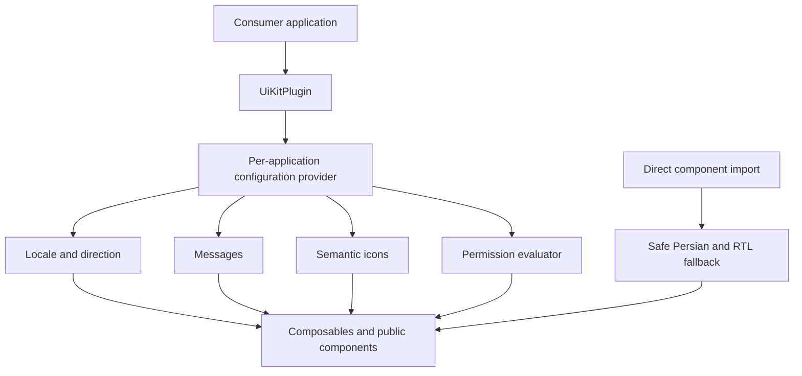

# UI platform foundations



`app.use(UiKitPlugin, options)` (or the backward-compatible default plugin export) creates an isolated context for each Vue application. Installation is optional: direct imports use safe Persian/RTL defaults. Consumers continue to own Vuetify, Pinia, and Router instances.

```ts
app.use(UiKit, {
  locale: 'en-US', direction: 'auto',
  messages: { 'en-US': { retry: 'Retry request' } },
  icons: { retry: MyRetryIcon },
  permissions: permission => currentUser.permissions.includes(permission),
  theme: { defaultTheme: 'brand', themes: { brand: brandTheme } }
})
```

`useUiKit()` exposes messages, semantic icons, direction, and permissions; `useUiKitConfig()` exposes resolved configuration. Built-ins are `fa-IR`/RTL and `en-US`/LTR. Overrides fall back to the built-in locale and `{name}` placeholders interpolate.

Focused APIs are also available through `useUiKitLocale`, `useUiKitMessages`, and `useUiKitIcons`. Calling `context.update()` supports reactive locale, direction, and configuration replacement without leaking between applications. The provider never mutates `document.documentElement`.

`defaultThemes` includes existing modern light/dark palettes and `mergeThemes` supports brands. Semantic icons accept Vuetify strings or Vue components. Public `--ui-*` CSS variables cover spacing, radii, shadows, surfaces, text, and status colors.

`usePermission()` provides `can`, `any`, and `all`. `PermissionGuard` supports single, any, and all requirements, a fallback slot, and hide/disable modes.

> UI permission visibility is not backend authorization. Server-side authorization remains mandatory. With no evaluator, visibility is fail-open for backward compatibility; configure `missingEvaluator: 'deny'` for fail-closed behavior.

`UiAsyncState` handles `idle`, `loading`, `empty`, `error`, `success`, and `permission-denied`; focused state components provide accessible roles, slots, localized defaults, semantic icons, and RTL/LTR direction.

For tests, `mountWithApp` installs Vuetify, UI Kit, Pinia, and a memory router, accepting provider configuration as its fourth argument. Package-root exports are public; injection keys and test helpers remain internal.

These foundations are designed to avoid browser side effects, but the wider package still contains browser-only components and is not claimed to be fully SSR-compatible. The documented package-root APIs are the stable Stage 1 surface; full i18n, accessibility certification, and multi-brand governance are explicitly outside this phase.
