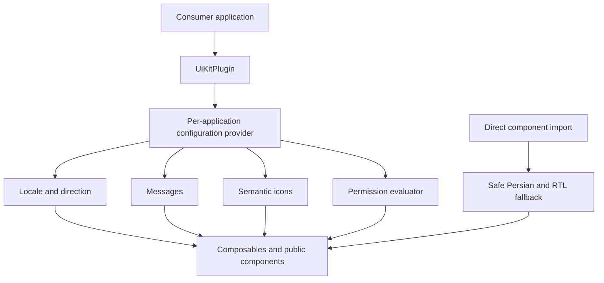

# UI platform foundations



`app.use(UiKitPlugin, options)` (or the backward-compatible default plugin export) creates an isolated context for each Vue application. Installation is optional: direct imports use safe Persian/RTL defaults. Consumers continue to own Vuetify, Pinia, and Router instances.

```ts
app.use(UiKit, {
  locale: 'en-US', direction: 'auto',
  messages: { 'en-US': { retry: 'Retry request' } },
  icons: { retry: MyRetryIcon },
  permissions: permission => currentUser.permissions.includes(permission),
  theme: { defaultTheme: 'brand', themes: { brand: brandTheme } }
})
```

`useUiKit()` exposes messages, semantic icons, direction, and permissions; `useUiKitConfig()` exposes resolved configuration. Built-ins are `fa-IR`/RTL and `en-US`/LTR. Overrides fall back to the built-in locale and `{name}` placeholders interpolate.

Focused APIs are also available through `useUiKitLocale`, `useUiKitMessages`, and `useUiKitIcons`. Calling `context.update()` supports reactive locale, direction, and configuration replacement without leaking between applications. The provider never mutates `document.documentElement`.

`update()` clones supplied nested maps before replacing them. `reset()` restores built-in Persian/RTL-auto defaults. Installing or updating another application cannot affect the current context. Invalid icon overrides fall back to the built-in semantic icon, and invalid runtime direction values are ignored.

Locale matching intentionally recognizes Persian and English language variants only. Persian variants use the Persian catalog and automatic RTL; all other and unknown locales use the English catalog and automatic LTR. An explicit direction remains authoritative until changed back to `auto`.

Message precedence is: exact-locale override, built-in-language override, built-in catalog. Explicit empty strings are preserved. Interpolation supports plain `{name}` placeholders with string, number, or boolean values; missing placeholders remain visible and extra parameters are ignored. Messages are rendered as text, never evaluated or interpreted as HTML.

`defaultThemes` includes existing modern light/dark palettes and `mergeThemes` supports brands. Semantic icons accept Vuetify strings or Vue components. Public `--ui-*` CSS variables cover spacing, radii, shadows, surfaces, text, and status colors.

`usePermission()` provides `can`, `any`, and `all`. `PermissionGuard` supports single, any, and all requirements, a fallback slot, and hide/disable modes.

> UI permission visibility is not backend authorization. Server-side authorization remains mandatory. With no evaluator, visibility is fail-open for backward compatibility; configure `missingEvaluator: 'deny'` for fail-closed behavior.

`{ any: [] }` denies because none of the alternatives can pass. `{ all: [] }` allows by standard vacuous-all semantics. Empty permission strings deny. A synchronous evaluator exception is contained and denies that requirement. Async evaluators are unsupported. The older application-specific permission directive remains separate and is not backed by this provider.

`UiAsyncState` handles `idle`, `loading`, `empty`, `error`, `success`, and `permission-denied`; focused state components provide accessible roles, slots, localized defaults, semantic icons, and RTL/LTR direction.

Because `UiAsyncState` is the component export, the generic package-root data contract is exported as `UiAsyncStateModel<T, E>`. The internal compatibility type name remains available within the focused async type module.

State components support compact/full presentation. Loading accepts bounded numeric progress. Empty and denied states expose optional accessible button actions. Error details are hidden unless `showDetails` is explicit, and only an `Error.message` or string is displayed. `UiAsyncState` provides `loading`, `empty`, `error`, `permission-denied`, and default slots and never executes requests.

Theme overrides win by name. `createUiKitThemes` validates names, `dark`, colors, and non-empty color strings, then returns cloned definitions so consumer and registry mutations do not modify built-ins or other instances.

Stable CSS variables include `--ui-color-*`, `--ui-space-*`, `--ui-radius-*`, `--ui-elevation-*`, `--ui-duration-*`, `--ui-easing-*`, `--ui-focus-*`, and `--ui-z-*`. Packed-package verification asserts representative variables from every governed category and reduced-motion CSS.

`DownloadButton` now uses localized download text, semantic icons, and provider direction when explicit props are absent. `BaseBreadcrumb` adopts provider direction and a typed Vue Router destination while preserving its props and slots.

For tests, `mountWithApp` installs Vuetify, UI Kit, Pinia, and a memory router, accepting provider configuration as its fourth argument. Package-root exports are public; injection keys and test helpers remain internal.

These foundations are designed to avoid browser side effects, but the wider package still contains browser-only components and is not claimed to be fully SSR-compatible. The documented package-root APIs are the stable Stage 1 surface; full i18n, accessibility certification, and multi-brand governance are explicitly outside this phase.

Dependency audit status: `happy-dom` is a development-only test environment dependency and requires a major update for the published fixes. `xlsx` is an optional runtime export feature with no registry fix available in the currently used package line. Neither finding is suppressed; avoid processing untrusted spreadsheets and evaluate the Happy DOM major upgrade separately.
